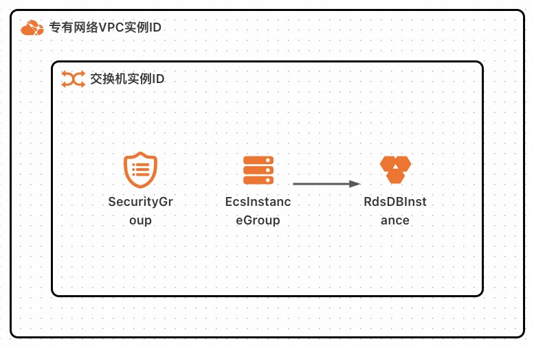
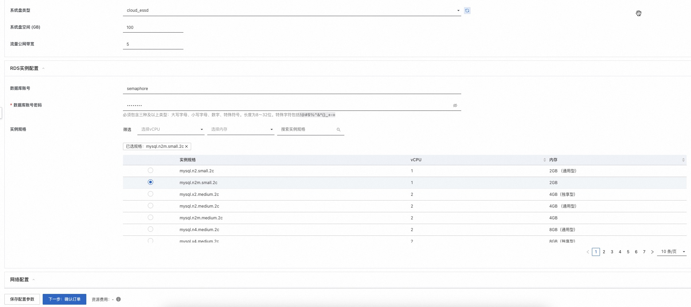
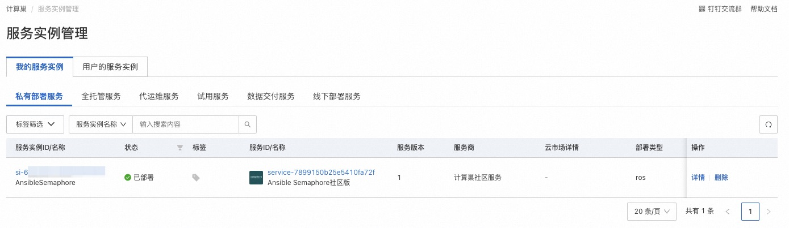
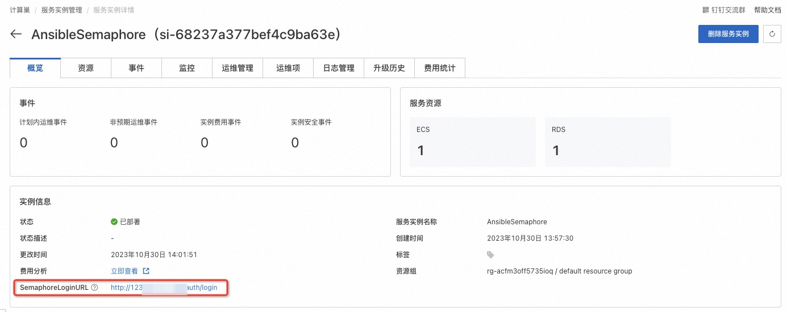
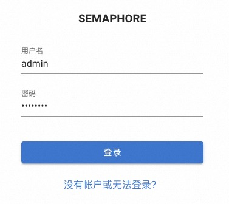
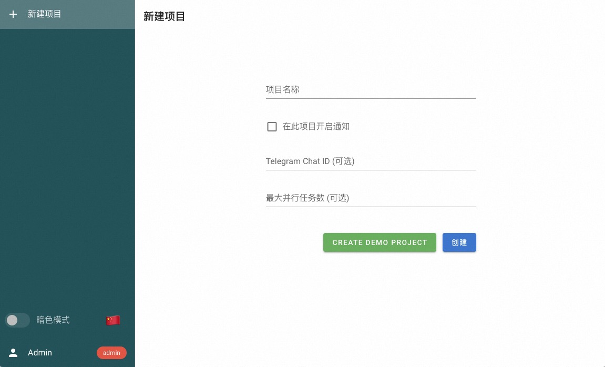
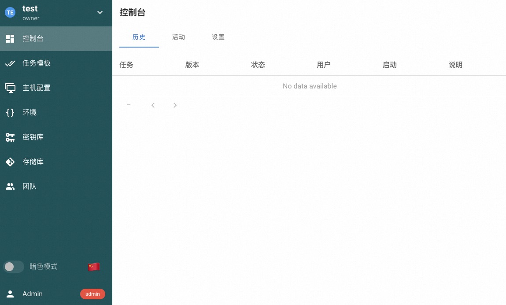

# Ansible Semaphore 部署文档

> **免责声明：**
>
> 本服务由第三方提供，我们尽力确保其安全性、准确性和可靠性，但无法保证其完全免于故障、中断、错误或攻击。因此，本公司在此声明：对于本服务的内容、准确性、完整性、可靠性、适用性以及及时性不作任何陈述、保证或承诺，不对您使用本服务所产生的任何直接或间接的损失或损害承担任何责任；对于您通过本服务访问的第三方网站、应用程序、产品和服务，不对其内容、准确性、完整性、可靠性、适用性以及及时性承担任何责任，您应自行承担使用后果产生的风险和责任；对于因您使用本服务而产生的任何损失、损害，包括但不限于直接损失、间接损失、利润损失、商誉损失、数据损失或其他经济损失，不承担任何责任，即使本公司事先已被告知可能存在此类损失或损害的可能性；我们保留不时修改本声明的权利，因此请您在使用本服务前定期检查本声明。如果您对本声明或本服务存在任何问题或疑问，请联系我们。

## 概述

Ansible Semaphore 是一个现代化的 Ansible 用户界面。它可以让您轻松运行 Ansible
Playbook，获取有关失败的通知，并控制部署系统的访问权限。如果您的项目已经发展壮大，从终端进行部署不再适合您，那么 Ansible
Semaphore 就是您需要的东西。

本文向您介绍如何开通计算巢上的 Ansible Semaphore，以及部署流程和使用说明。

## 计费说明

Ansible Semaphore 在计算巢上的费用主要涉及：

- 所选 vCPU 与内存规格
- 系统盘类型及容量
- 公网带宽
- 所选 RDS 数据库实例规格

## 部署架构

## RAM 账号所需权限

Ansible
Semaphore 服务需要对 ECS、RDS、VPC 等资源进行访问和创建操作，若您使用 RAM 用户创建服务实例，需要在创建服务实例前，对使用的 RAM 用户的账号添加相应资源的权限。添加 RAM 权限的详细操作，请参见[为 RAM 用户授权](https://help.aliyun.com/document_detail/121945.html)
。所需权限如下表所示。

| 权限策略名称                    | 备注                                      |
| ------------------------------- | ----------------------------------------- |
| AliyunECSFullAccess             | 管理云服务器服务（ECS）的权限             |
| AliyunRDSFullAccess             | 管理云数据库服务(RDS)的权限               |
| AliyunVPCReadOnlyAccess         | 只读访问专有网络（VPC）的权限             |
| AliyunROSFullAccess             | 管理资源编排服务（ROS）的权限             |
| AliyunComputeNestUserFullAccess | 管理计算巢服务（ComputeNest）的用户侧权限 |
| AliyunCloudMonitorFullAccess    | 管理云监控（CloudMonitor）的权限          |

## 部署流程

### 部署步骤

单击[部署链接](https://computenest.console.aliyun.com/service/instance/create/cn-hangzhou?type=user&ServiceId=service-7899150b25e5410fa72f)
，进入服务实例部署界面，根据界面提示，填写参数完成部署。

### 部署参数说明

您在创建服务实例的过程中，需要配置服务实例信息。下文介绍 Ansible Semaphore 服务实例输入参数的详细信息。

| 参数组                 | 参数项               | 示例                 | 说明                                                                                                                                      |
| ---------------------- | -------------------- | -------------------- | ----------------------------------------------------------------------------------------------------------------------------------------- |
| 服务实例名称           |                      | semaphore-2v6o       | 实例的名称                                                                                                                                |
| 地域                   |                      | 华东 1（杭州）       | 选中服务实例的地域，建议就近选中，以获取更好的网络延时。                                                                                  |
| Ansible Semaphore 配置 | 管理员密码           | \*\*\*\*\*\*\*\*     | Ansible Semaphore 管理员账号（账号名称 admin）密码。                                                                                      |
| ECS 实例配置           | 实例类型             | ecs.gn6i-c4g1.xlarge | ECS 实例规格，可以根据实际需求选择。                                                                                                      |
| ECS 实例配置           | 系统盘类型           | ESSD 云盘            | ECS 实例系统盘类型，可以根据实际需求选择。                                                                                                |
| ECS 实例配置           | 系统盘空间 (GB)      | 100                  | ECS 实例系统盘大小，可以根据实际需求设置。                                                                                                |
| ECS 实例配置           | 流量公网带宽 (M)     | 5                    | ECS 实例公网带宽大小，可以根据实际需求设置。                                                                                              |
| RDS 实例配置           | 数据库账号           | semaphore            | 连接数据库所使用的账号名称。                                                                                                              |
| RDS 实例配置           | 数据库账号密码       | \*\*\*\*\*\*\*\*     | 连接数据库所使用的账号密码。必须包含三种及以上类型：大写字母、小写字母、数字、特殊符号。长度为 8 ～ 32 位。特殊字符包括`!@#$%^&*()_+-=`。 |
| RDS 实例配置           | 实例规格             | mysql.n2m.small.2c   | 使用的 RDS 数据库实例规格。                                                                                                               |
| 网络配置               | 可用区               | 可用区 K             | 地域下的不同可用区域。                                                                                                                    |
| 网络配置               | 专有网络 VPC 实例 ID | vpc-\*\*\*\*\*\*\*\* |                                                                                                                                           |
| 网络配置               | 交换机实例 ID        | vsw-\*\*\*\*\*\*\*\* |                                                                                                                                           |

### 验证结果

1. 查看服务实例。服务实例创建成功后，部署时间大约需要 6 分钟。部署完成后，页面上可以看到对应的服务实例。

2. 通过服务实例访问 Ansible Semaphore。

3. 进入到对应的服务实例后，点击 SemaphoreLoginURL 后面的链接,输入账号为admin，密码为部署参数中设置的管理员密码。

4. 完成验证后即可访问 Ansible Semaphore，输入项目名称，点击“CREATE DEMO PROJECT”即可创建演示项目。

## 帮助文档

请访问 Ansible Semaphore 用户指南了解如何使用：[使用文档](https://docs.ansible-semaphore.com/user-guide/projects)。
